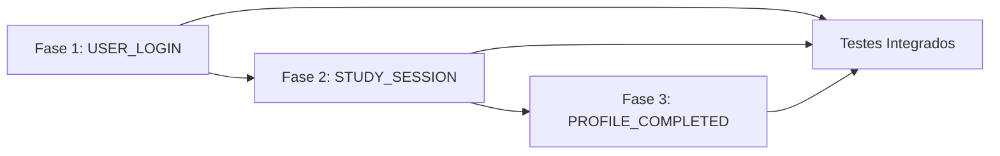

# 📊 Plano de Implementação de Eventos para Sistema de Conquistas

> **Documento de Diagnóstico e Planejamento**  
> **Data de Criação**: 2025-09-09  
> **Status**: 🔴 Aguardando Implementação  
> **Versão**: 1.0

---

## 📌 Resumo Executivo

### Status Atual
O sistema de conquistas (achievements) está **parcialmente implementado**. Dos 14 tipos de critérios de conquista (`BadgeCriteriaType`), apenas **4 estão totalmente funcionais** devido à falta de eventos sendo disparados nos casos de uso correspondentes.

### Impacto
- **28%** das conquistas estão funcionais (4 de 14 tipos)
- **8 tipos de conquistas** estão completamente não-funcionais
- **Usuários não conseguem** desbloquear conquistas relacionadas a login, tempo de estudo e perfil

### Objetivo
Implementar os eventos faltantes para tornar **100% das conquistas funcionais**, seguindo uma abordagem faseada e estruturada.

---

## 📈 Diagnóstico Detalhado

### Tabela de Status dos Eventos

| Evento | Status | Arquivo do Evento | Onde Deveria Disparar | Tipos de Conquista Afetados |
|--------|--------|-------------------|----------------------|----------------------------|
| `LESSON_COMPLETED` | ✅ Funcional | `LessonCompletedEvent.ts` | `CompleteLessonProgressUseCase` | `LESSON_COMPLETION` |
| `COURSE_COMPLETED` | ✅ Funcional | `CourseCompletedEvent.ts` | `CompleteCourseUseCase` | `COURSE_COMPLETION`, `TRAIL_COMPLETION` |
| `CERTIFICATE_EARNED` | ✅ Funcional | `CertificateEarnedEvent.ts` | `GenerateCertificateUseCase` | `CERTIFICATE_ACHIEVED` |
| `QUESTIONNAIRE_COMPLETED` | ✅ Funcional | `QuestionnaireCompletedEvent.ts` | `SubmitQuestionnaireUseCase` | `QUESTIONNAIRE_COMPLETION`, `PERFECT_SCORE`, `RETRY_PERSISTENCE` |
| `USER_LOGIN` | ❌ Não Disparado | `UserLoginEvent.ts` | `SignInWithEmailLinkUseCase` | `DAILY_LOGIN`, `STUDY_STREAK`, `FIRST_TIME_ACTIVITIES`, `TIME_BASED_ACCESS` |
| `STUDY_SESSION_COMPLETED` | ❌ Não Disparado | `StudySessionEvent.ts` | `UpdateContentProgressUseCase` | `STUDY_TIME`, `CONTENT_TYPE_DIVERSITY` |
| `PROFILE_COMPLETED` | ❌ Não Disparado | `ProfileCompletedEvent.ts` | Use case não existe | `PROFILE_COMPLETION` |

### Mapeamento Completo de Conquistas

```typescript
// ProcessAchievementProgressUseCase.ts - Mapeamento Atual
const eventMappings: Record<BadgeCriteriaType, string[]> = {
  // ✅ FUNCIONAIS
  [BadgeCriteriaType.LESSON_COMPLETION]: ['LESSON_COMPLETED'],
  [BadgeCriteriaType.COURSE_COMPLETION]: ['COURSE_COMPLETED'],
  [BadgeCriteriaType.CERTIFICATE_ACHIEVED]: ['CERTIFICATE_EARNED'],
  [BadgeCriteriaType.QUESTIONNAIRE_COMPLETION]: ['QUESTIONNAIRE_COMPLETED'],
  [BadgeCriteriaType.PERFECT_SCORE]: ['QUESTIONNAIRE_COMPLETED'],
  [BadgeCriteriaType.RETRY_PERSISTENCE]: ['QUESTIONNAIRE_COMPLETED'],
  [BadgeCriteriaType.TRAIL_COMPLETION]: ['COURSE_COMPLETED'],
  
  // ❌ NÃO FUNCIONAIS
  [BadgeCriteriaType.DAILY_LOGIN]: ['USER_LOGIN'],
  [BadgeCriteriaType.STUDY_STREAK]: ['USER_LOGIN'],
  [BadgeCriteriaType.FIRST_TIME_ACTIVITIES]: ['USER_LOGIN'],
  [BadgeCriteriaType.TIME_BASED_ACCESS]: ['USER_LOGIN'],
  [BadgeCriteriaType.STUDY_TIME]: ['STUDY_SESSION_COMPLETED'],
  [BadgeCriteriaType.CONTENT_TYPE_DIVERSITY]: ['STUDY_SESSION_COMPLETED'],
  [BadgeCriteriaType.PROFILE_COMPLETION]: ['PROFILE_COMPLETED'],
};
```

### Conquistas Impactadas

#### 🔴 Não Funcionais por Falta de `USER_LOGIN`:
1. **"Bem-vindo(a)!"** - Primeiro login (1 dia)
2. **"Estudante Consistente"** - 7 dias consecutivos
3. **"Maratonista do Saber"** - 30 dias consecutivos
4. **"Ritmo de Estudo"** - Sequência de 7 dias
5. **"Hábito Formado"** - 21 dias consecutivos

#### 🔴 Não Funcionais por Falta de `STUDY_SESSION_COMPLETED`:
1. **"Explorador do Conhecimento"** - 10 horas de estudo
2. **"Estudioso Dedicado"** - 50 horas de estudo
3. **"Acadêmico Incansável"** - 100 horas de estudo

#### 🔴 Não Funcionais por Falta de `PROFILE_COMPLETED`:
1. **"Perfil Completo"** - 100% do perfil preenchido

---

## 🚀 Fases de Implementação

## 📍 FASE 1: Implementar USER_LOGIN Event

### 🎯 Objetivo
Habilitar conquistas relacionadas a login diário e sequências de estudo.

### 📂 Arquivos Afetados
- `src/_core/modules/auth/core/use-cases/sign-in-with-email-link/sign-in-with-email-link.use-case.ts`
- `src/_core/modules/auth/infrastructure/services/AuthService.ts` (possível)
- Possível criação de: `src/_core/modules/user/infrastructure/repositories/UserLoginHistoryRepository.ts`

### ✅ Checklist de Pré-requisitos
- [ ] Verificar se existe repositório para histórico de login
- [ ] Definir estrutura de dados para rastrear logins consecutivos
- [ ] Verificar se institutionId está disponível no contexto de login
- [ ] Confirmar formato de dados do UserLoginEvent

### 📋 Checklist de Implementação
- [ ] Importar `EventBus` e `UserLoginEvent`
- [ ] Injetar `EventBus` no constructor do use case
- [ ] Implementar lógica para calcular dias consecutivos:
  ```typescript
  // Pseudocódigo
  const lastLogin = await userLoginHistoryRepo.getLastLogin(userId);
  const consecutiveDays = calculateConsecutiveDays(lastLogin, now);
  const isFirstLogin = await userLoginHistoryRepo.isFirstLogin(userId);
  ```
- [ ] Disparar evento após login bem-sucedido:
  ```typescript
  const loginEvent = UserLoginEvent.create({
    userId,
    institutionId,
    loginTime: new Date(),
    consecutiveDays,
    isFirstLogin,
    dayOfWeek: new Date().getDay(),
    hourOfDay: new Date().getHours()
  });
  await this.eventBus.publish(loginEvent);
  ```
- [ ] Salvar registro de login no histórico
- [ ] Tratar erros sem bloquear o login

### 🧪 Checklist de Testes
- [ ] Testar primeiro login de usuário
- [ ] Testar login consecutivo (2 dias seguidos)
- [ ] Testar quebra de sequência (pular 1 dia)
- [ ] Testar múltiplos logins no mesmo dia
- [ ] Verificar se conquistas são desbloqueadas corretamente

### 💬 Pontos de Discussão
1. **Armazenamento de Histórico**: Onde e como armazenar histórico de logins?
2. **Timezone**: Como lidar com diferentes fusos horários?
3. **Performance**: Calcular consecutividade a cada login ou manter contador?
4. **Múltiplos Logins**: Contar apenas o primeiro login do dia?
5. **Instituições Múltiplas**: Rastrear por instituição ou globalmente?

### ⚠️ Riscos e Mitigações
| Risco | Probabilidade | Impacto | Mitigação |
|-------|--------------|---------|-----------|
| Performance degradada no login | Média | Alto | Processar evento de forma assíncrona |
| Falha ao calcular consecutividade | Baixa | Médio | Implementar fallback e logging |
| Timezone incorreto | Alta | Médio | Usar UTC e converter no frontend |

---

## 📍 FASE 2: Implementar STUDY_SESSION_COMPLETED Event

### 🎯 Objetivo
Habilitar conquistas relacionadas a tempo de estudo e diversidade de conteúdo.

### 📂 Arquivos Afetados
- `src/_core/modules/content/core/use-cases/update-content-progress/update-content-progress.use-case.ts`
- `src/_core/modules/content/core/use-cases/complete-lesson-progress/complete-lesson-progress.use-case.ts`
- Possível criação de: `src/_core/modules/content/core/services/StudySessionTracker.ts`

### ✅ Checklist de Pré-requisitos
- [ ] Definir o que constitui uma "sessão de estudo"
- [ ] Determinar como calcular duração da sessão
- [ ] Identificar tipos de conteúdo disponíveis
- [ ] Verificar se há rastreamento de tempo existente

### 📋 Checklist de Implementação
- [ ] Importar `EventBus` e `StudySessionEvent`
- [ ] Injetar `EventBus` no constructor
- [ ] Implementar rastreamento de sessão:
  ```typescript
  // Quando conteúdo atinge 100%
  if (contentProgress.isCompleted() && !wasContentCompleted) {
    const sessionData = {
      userId,
      institutionId,
      sessionId: generateSessionId(),
      startTime: contentProgress.startedAt,
      endTime: new Date(),
      durationInSeconds: calculateDuration(),
      contentTypes: [content.type],
      lessonsCompleted: 1,
      contentId,
      courseId,
      moduleId
    };
    
    const studyEvent = StudySessionEvent.create(sessionData);
    await this.eventBus.publish(studyEvent);
  }
  ```
- [ ] Acumular tempo total de estudo
- [ ] Rastrear diversidade de tipos de conteúdo
- [ ] Implementar agregação de sessões curtas

### 🧪 Checklist de Testes
- [ ] Testar conclusão de conteúdo único
- [ ] Testar sessão com múltiplos conteúdos
- [ ] Testar diferentes tipos de conteúdo (vídeo, PDF, etc.)
- [ ] Verificar cálculo correto de duração
- [ ] Testar conquistas de tempo (10h, 50h, 100h)

### 💬 Pontos de Discussão
1. **Definição de Sessão**: Uma lição? Um módulo? Tempo contínuo?
2. **Timeout de Sessão**: Quanto tempo de inatividade encerra uma sessão?
3. **Agregação**: Como somar tempos de múltiplas sessões?
4. **Tipos de Conteúdo**: Quais tipos contar para diversidade?
5. **Precisão**: Arredondar segundos? Minutos?

### ⚠️ Riscos e Mitigações
| Risco | Probabilidade | Impacto | Mitigação |
|-------|--------------|---------|-----------|
| Cálculo incorreto de tempo | Média | Alto | Validar com timestamps do servidor |
| Sessões duplicadas | Baixa | Baixo | Usar IDs únicos e deduplicação |
| Perda de dados de sessão | Baixa | Médio | Salvar progresso incrementalmente |

---

## 📍 FASE 3: Implementar PROFILE_COMPLETED Event

### 🎯 Objetivo
Habilitar conquista de perfil completo.

### 📂 Arquivos Afetados
- Criar: `src/_core/modules/user/core/use-cases/update-user-profile/`
- Ou modificar use case existente de atualização de usuário
- `src/_core/modules/user/core/entities/User.ts` (adicionar método de cálculo)

### ✅ Checklist de Pré-requisitos
- [ ] Definir campos obrigatórios para perfil completo
- [ ] Verificar estrutura atual do perfil de usuário
- [ ] Identificar use case de atualização de perfil existente
- [ ] Determinar peso de cada campo (se aplicável)

### 📋 Checklist de Implementação
- [ ] Criar/modificar use case de atualização de perfil
- [ ] Implementar cálculo de completude:
  ```typescript
  // Na entidade User ou serviço
  calculateProfileCompleteness(): number {
    const requiredFields = [
      'name',
      'email', 
      'phone',
      'birthDate',
      'avatar',
      'bio',
      'address',
      'education'
    ];
    
    const filledFields = requiredFields.filter(field => 
      this[field] && this[field].trim() !== ''
    );
    
    return Math.round((filledFields.length / requiredFields.length) * 100);
  }
  ```
- [ ] Disparar evento quando atingir 100%:
  ```typescript
  const completeness = user.calculateProfileCompleteness();
  
  if (completeness === 100 && previousCompleteness < 100) {
    const profileEvent = ProfileCompletedEvent.create({
      userId,
      institutionId,
      completionPercentage: 100,
      completedAt: new Date(),
      fieldsCompleted: getCompletedFields()
    });
    await this.eventBus.publish(profileEvent);
  }
  ```
- [ ] Atualizar UI para mostrar progresso

### 🧪 Checklist de Testes
- [ ] Testar perfil vazio (0%)
- [ ] Testar perfil parcial (50%)
- [ ] Testar perfil completo (100%)
- [ ] Testar remoção de campo (volta para < 100%)
- [ ] Verificar disparo único do evento

### 💬 Pontos de Discussão
1. **Campos Obrigatórios**: Quais campos são essenciais?
2. **Campos Opcionais**: Incluir na contagem?
3. **Validação**: Apenas preenchido ou validado (email válido, etc.)?
4. **Retroativo**: Processar perfis já completos?
5. **UI Feedback**: Mostrar barra de progresso?

### ⚠️ Riscos e Mitigações
| Risco | Probabilidade | Impacto | Mitigação |
|-------|--------------|---------|-----------|
| Definição unclear de "completo" | Alta | Médio | Documentar claramente requisitos |
| Mudança futura nos campos | Média | Baixo | Tornar configurável |
| Performance no cálculo | Baixa | Baixo | Cache do valor calculado |

---

## 🔧 Considerações Técnicas Gerais

### Padrões de Código
```typescript
// Padrão para disparar eventos
try {
  const event = EventClass.create(eventData);
  await this.eventBus.publish(event);
  console.log(`✅ ${eventName} published for user:`, userId);
} catch (error) {
  console.error(`❌ Failed to publish ${eventName}:`, error);
  // Não falhar o use case principal
}
```

### Performance
- **Assíncrono**: Eventos devem ser processados de forma assíncrona
- **Não-bloqueante**: Falha em eventos não deve bloquear operação principal
- **Batch Processing**: Considerar processar múltiplos eventos em batch
- **Caching**: Cache de dados frequentemente acessados (login history, etc.)

### Tratamento de Erros
- **Graceful Degradation**: Sistema funciona mesmo sem eventos
- **Logging Detalhado**: Registrar todas falhas de eventos
- **Retry Logic**: Implementar retry para eventos críticos
- **Dead Letter Queue**: Para eventos que falharam múltiplas vezes

### Logging e Monitoramento
```typescript
// Estrutura de log sugerida
logger.info('Event Published', {
  eventType: 'USER_LOGIN',
  userId,
  institutionId,
  timestamp: new Date().toISOString(),
  metadata: { consecutiveDays, isFirstLogin }
});
```

---

## 📅 Cronograma Sugerido

### Priorização
1. **🔴 Alta Prioridade**: USER_LOGIN (Fase 1)
   - Impacta 5+ conquistas
   - Engajamento diário
   - **Estimativa**: 2-3 dias

2. **🟡 Média Prioridade**: STUDY_SESSION_COMPLETED (Fase 2)
   - Impacta 3+ conquistas
   - Métricas importantes
   - **Estimativa**: 2-3 dias

3. **🟢 Baixa Prioridade**: PROFILE_COMPLETED (Fase 3)
   - Impacta 1 conquista
   - Menos crítico
   - **Estimativa**: 1-2 dias

### Dependências


### Timeline Total Estimada
- **Desenvolvimento**: 5-8 dias
- **Testes**: 2-3 dias
- **Documentação**: 1 dia
- **Total**: ~2 semanas

---

## 📝 Checklist Master de Implementação

### Preparação
- [ ] Revisar e aprovar este documento
- [ ] Discutir pontos em aberto de cada fase
- [ ] Definir prioridades finais
- [ ] Alocar recursos necessários

### Fase 1: USER_LOGIN
- [ ] Discussão de requisitos
- [ ] Implementação
- [ ] Testes unitários
- [ ] Testes de integração
- [ ] Code review
- [ ] Deploy

### Fase 2: STUDY_SESSION_COMPLETED
- [ ] Discussão de requisitos
- [ ] Implementação
- [ ] Testes unitários
- [ ] Testes de integração
- [ ] Code review
- [ ] Deploy

### Fase 3: PROFILE_COMPLETED
- [ ] Discussão de requisitos
- [ ] Implementação
- [ ] Testes unitários
- [ ] Testes de integração
- [ ] Code review
- [ ] Deploy

### Finalização
- [ ] Testes end-to-end completos
- [ ] Validação de todas as conquistas
- [ ] Atualização de documentação
- [ ] Comunicação para usuários

---

## 📊 Métricas de Sucesso

### KPIs Técnicos
- ✅ 100% dos eventos mapeados e funcionais
- ✅ 0 erros críticos em produção
- ✅ < 100ms de latência adicional no login
- ✅ 100% de cobertura de testes nos novos códigos

### KPIs de Negócio
- 📈 Aumento de 30% no engajamento (conquistas desbloqueadas)
- 📈 Aumento de 20% em logins diários
- 📈 Aumento de 15% em tempo médio de estudo
- 📈 Aumento de 25% em perfis completos

---

## 🔄 Histórico de Revisões

| Versão | Data | Autor | Mudanças |
|--------|------|-------|----------|
| 1.0 | 2025-09-09 | Sistema | Documento inicial criado |

---

## 📚 Referências

- [ProcessAchievementProgressUseCase.ts](src/_core/modules/achievement/core/useCases/ProcessAchievementProgressUseCase.ts)
- [BadgeCriteriaType.ts](src/_core/modules/badge/core/entities/BadgeCriteriaType.ts)
- [Eventos de Achievement](src/_core/modules/achievement/core/events/)
- [Use Cases de Auth](src/_core/modules/auth/core/use-cases/)
- [Use Cases de Content](src/_core/modules/content/core/use-cases/)

---

**Status do Documento**: ✅ Pronto para Revisão e Discussão