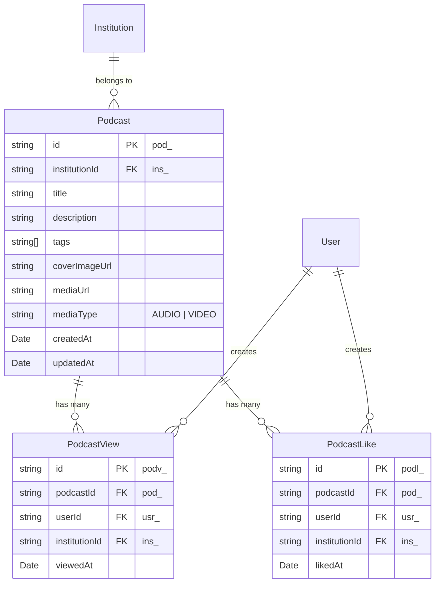

# 📋 Checklist de Implementação - Módulo Podcast

**Data de Criação**: 27/01/2025  
**Status Geral**: ✅ **CONCLUÍDO**  
**Data de Conclusão**: 27/01/2025 - 13:13

## 🎯 Objetivo
Implementar o módulo `podcast` seguindo os padrões estabelecidos no projeto ClimaEdu, incluindo Clean Architecture, SOLID principles, Object Calisthenics e integração com Firebase.

## 📊 Progresso Geral
**Total de Tarefas**: 39  
**Concluídas**: 39  
**Em Progresso**: 0  
**Pendentes**: 0  
**Progresso**: 100%

---

## 🏗️ **Fase 1: Estrutura Base**
- [x] 1.1 Criar estrutura de diretórios do módulo
- [x] 1.2 Criar arquivo de documentação bounded context
- [x] 1.3 Atualizar convenção de IDs

**Status da Fase**: ✅ Concluída  
**Progresso**: 3/3 (100%)

---

## 🎯 **Fase 2: Entidades**
- [x] 2.1 Implementar entidade Podcast
- [x] 2.2 Implementar entidade PodcastView  
- [x] 2.3 Implementar entidade PodcastLike
- [x] 2.4 Criar enum PodcastMediaType

**Status da Fase**: ✅ Concluída  
**Progresso**: 4/4 (100%)

---

## 🗂️ **Fase 3: Repositórios**
- [x] 3.1 Criar interface PodcastRepository
- [x] 3.2 Criar interface PodcastViewRepository
- [x] 3.3 Criar interface PodcastLikeRepository
- [x] 3.4 Implementar FirebasePodcastRepository
- [x] 3.5 Implementar FirebasePodcastViewRepository
- [x] 3.6 Implementar FirebasePodcastLikeRepository

**Status da Fase**: ✅ Concluída  
**Progresso**: 6/6 (100%)

---

## ⚙️ **Fase 4: Casos de Uso - Gestão**
- [x] 4.1 CreatePodcastUseCase (input, output, use-case)
- [x] 4.2 UpdatePodcastUseCase (input, output, use-case)
- [x] 4.3 DeletePodcastUseCase (input, output, use-case)
- [x] 4.4 ListPodcastsUseCase (input, output, use-case)
- [x] 4.5 GetPodcastUseCase (input, output, use-case)

**Status da Fase**: ✅ Concluída  
**Progresso**: 5/5 (100%)

---

## 📊 **Fase 5: Casos de Uso - Monitoramento**
- [x] 5.1 AddViewToPodcastUseCase (input, output, use-case)
- [x] 5.2 ToggleLikePodcastUseCase (input, output, use-case)
- [x] 5.3 GetPodcastAnalyticsUseCase (input, output, use-case)

**Status da Fase**: ✅ Concluída  
**Progresso**: 3/3 (100%)

---

## 🔗 **Fase 6: Dependency Injection**
- [x] 6.1 Criar symbols do módulo podcast
- [x] 6.2 Criar register do módulo podcast
- [x] 6.3 Integrar no container principal
- [x] 6.4 Atualizar exports dos symbols principais

**Status da Fase**: ✅ Concluída  
**Progresso**: 4/4 (100%)

---

## 📦 **Fase 7: Exports e Integração**
- [x] 7.1 Criar index.ts do módulo
- [x] 7.2 Exportar todas as entidades
- [x] 7.3 Exportar todos os casos de uso
- [x] 7.4 Exportar todos os repositórios

**Status da Fase**: ✅ Concluída  
**Progresso**: 4/4 (100%)

---

## 📚 **Fase 8: Documentação**
- [x] 8.1 Criar documentação bounded context completa
- [x] 8.2 Atualizar Memory Bank com padrões do módulo
- [x] 8.3 Documentar exemplos de uso

**Status da Fase**: ✅ Concluída  
**Progresso**: 3/3 (100%)

---

## 🧪 **Fase 9: Validação**
- [x] 9.1 Verificar estrutura de arquivos
- [x] 9.2 Validar imports e exports
- [x] 9.3 Testar container DI
- [x] 9.4 Verificar convenções de código

**Status da Fase**: ✅ Concluída  
**Progresso**: 4/4 (100%)

---

## ✅ **Fase 10: Finalização**
- [x] 10.1 Atualizar Memory Bank com status final
- [x] 10.2 Criar resumo de implementação
- [x] 10.3 Documentar próximos passos (frontend)

**Status da Fase**: ✅ Concluída  
**Progresso**: 3/3 (100%)

---

## 📝 **Log de Atividades**

### 27/01/2025 - 10:21
- ✅ Checklist criado no memory-bank
- 🔄 Iniciando Fase 1: Estrutura Base

---

## 🎨 **Diagrama de Entidades (Referência)**

---

## 🏷️ **Convenções de ID**
- **Podcast**: `pod_` (ex: `pod_abc123`)
- **PodcastView**: `podv_` (ex: `podv_xyz789`)
- **PodcastLike**: `podl_` (ex: `podl_def456`)

---

## 📋 **Observações**
- Seguir rigorosamente os padrões do projeto
- Manter consistência com módulo `content`
- Aplicar Clean Architecture e SOLID principles
- Usar Object Calisthenics
- Integração completa com Firebase
- Sistema de monitoramento robusto
